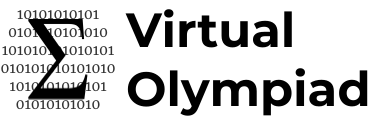

> Site still in development

# Virtual Olympiad

### Online Multiplayer Mock Competitions for Math

Virtual Olympiad (VO) is a platform for hosting multiplayer practice math contests in a competitive style using questions from past contests!

[**→ Check out the Virtual Olympiad website**](https://virtual-olympiad.herokuapp.com)

## Other VO Projects

VOBot is a Discord bot to generate competition math problems from past contests.

[**→ Check out VOBot**](https://polarr.github.io/vobot)

## Guide

[**→ Check out the VO Guide**](https://github.com/polarr/virtual-olympiad/wiki/Guide)

## FAQ 

[**→ Check out the VO FAQ**](https://github.com/polarr/virtual-olympiad/wiki/FAQ)

## License

VO is open-distribution software by [polarity](https://github.com/polarr) licensed under [GPL 2.0 + Commons Clause](LICENSE) (**No** commercial use)

---

© 2021-present polarity
